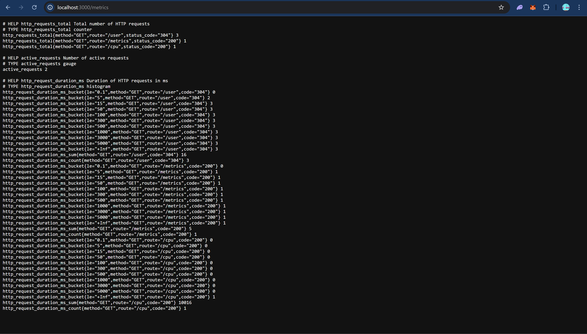
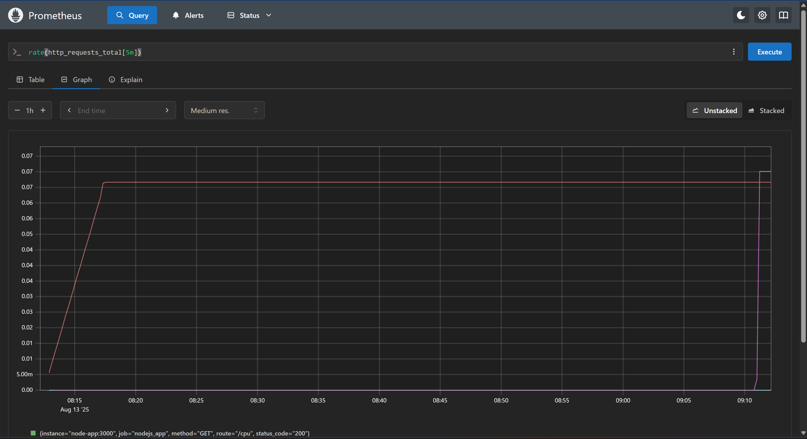
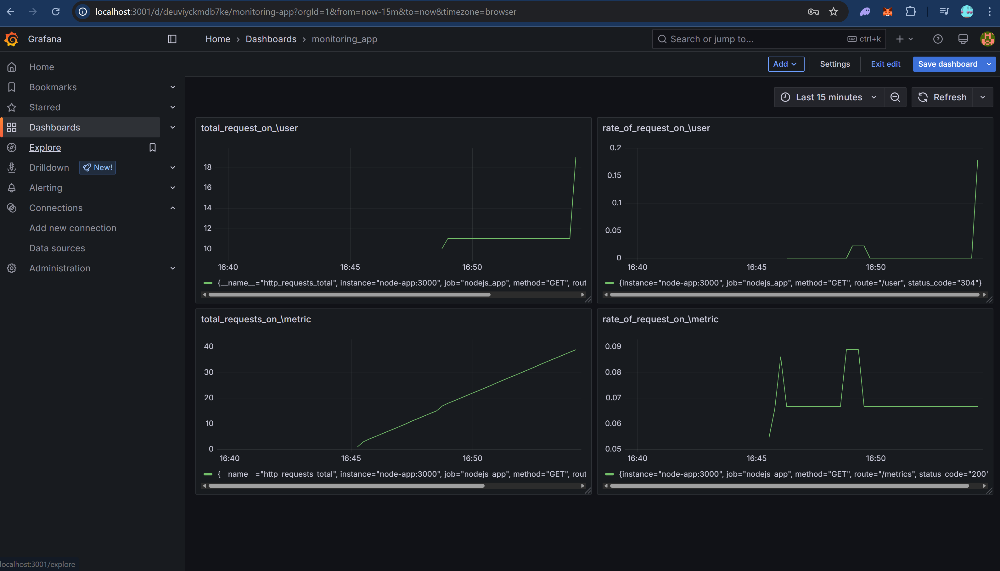

# Prom_and_Graf

A Node.js/TypeScript project for exposing custom application metrics using Prometheus and visualizing them with Grafana.

## Features
- Custom metrics for HTTP requests (count, duration, active requests)
- Middleware for automatic metrics collection
- TypeScript support
- Easy integration with Prometheus and Grafana

## Project Structure
```
.
├── assets/
│   ├── grafana.png
│   ├── graph.png
│   └── metric_endpoint.png
├── src/
│   ├── index.ts                # Main entry point
│   ├── metrics/
│   │   ├── activeRequestsGauge.ts
│   │   ├── requestCount.ts
│   │   └── requestDuration.ts
│   └── middleware/
│       └── metrics.middleware.ts
├── .dockerignore
├── .gitignore
├── docker-compose.yml
├── Dockerfile
├── package.json
├── package-lock.json
├── prometheus.yml
├── tsconfig.json
├── tsconfig.tsbuildinfo
├── README.md
```

## Getting Started

### Prerequisites
- Node.js (v16+ recommended)
- npm or yarn

### Installation
```sh
npm install
```

### Build
```sh
npm run build
```

### Run
```sh
npm run start
```
### Dev
```sh
npm run dev
```
## Output

### Metrics Endpoint
Below is an image of the metrics endpoint output:



### Prometheus Visualization
Below is an image of how the metrics appear in Prometheus:



### Grafana Dashboard 
Below is an image of how the metrics appear in a Grafana dashboard:


1. Start the application.
2. Metrics will be exposed at the configured endpoint (e.g., `/metrics`).
3. Configure Prometheus to scrape the metrics endpoint.
4. Use Grafana to visualize the collected metrics.

## Metrics Exposed
- **request_count**: Total number of HTTP requests
- **request_duration_seconds**: Duration of HTTP requests
- **active_requests**: Number of active HTTP requests


## Development
- Source code is in the `src/` directory.
- Metrics logic is in `src/metrics/`.
- Middleware is in `src/middleware/`.

